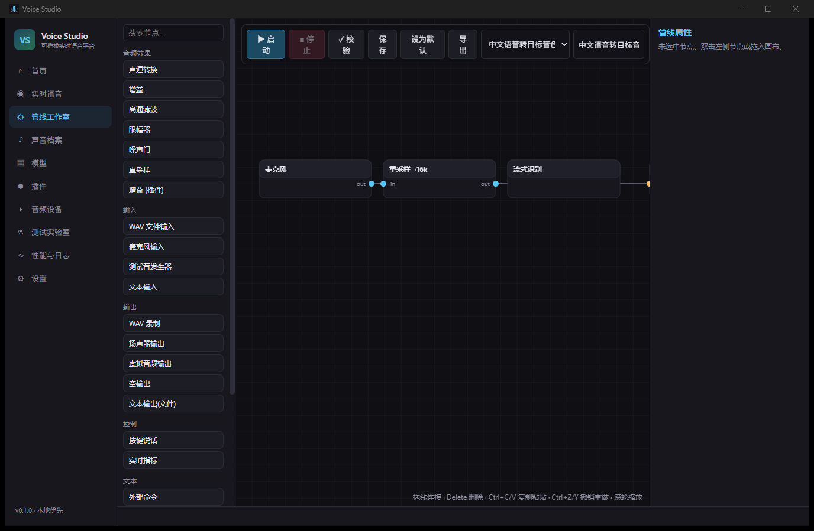
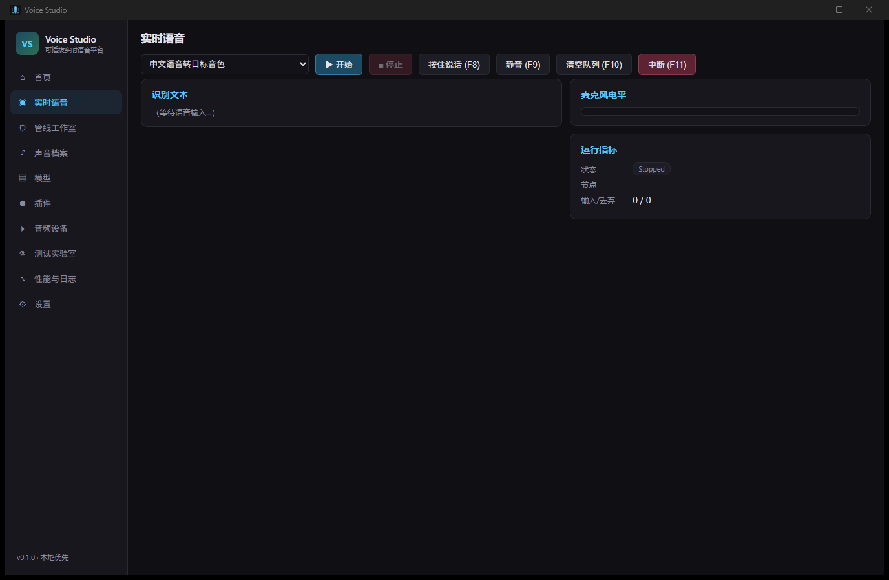
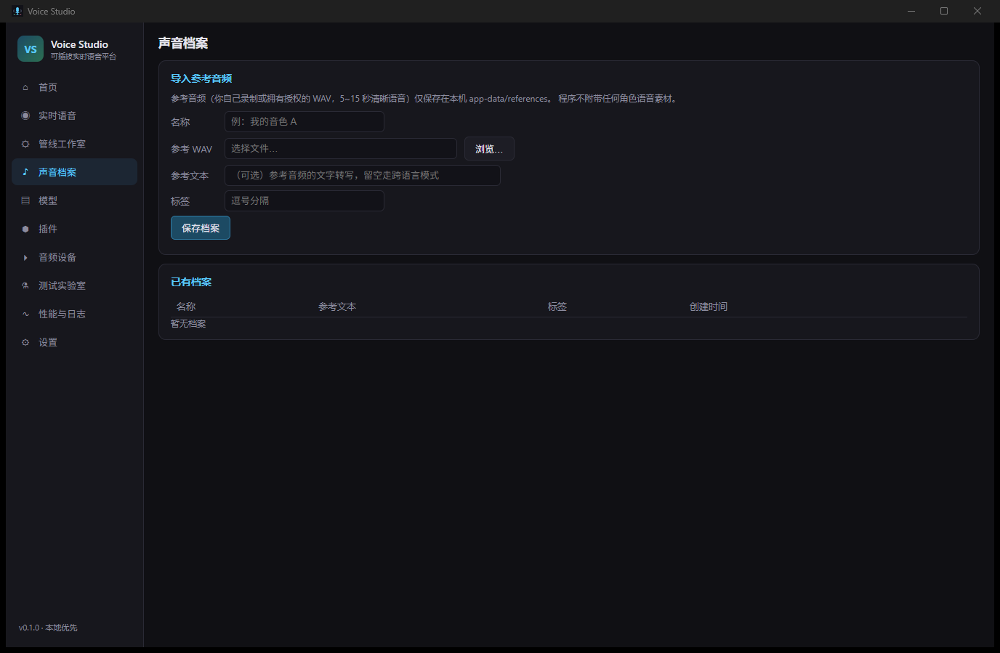
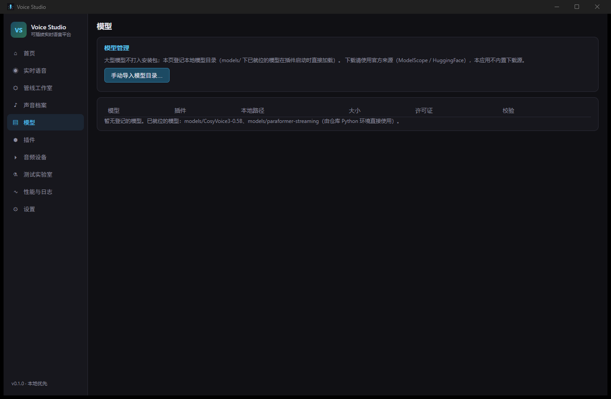
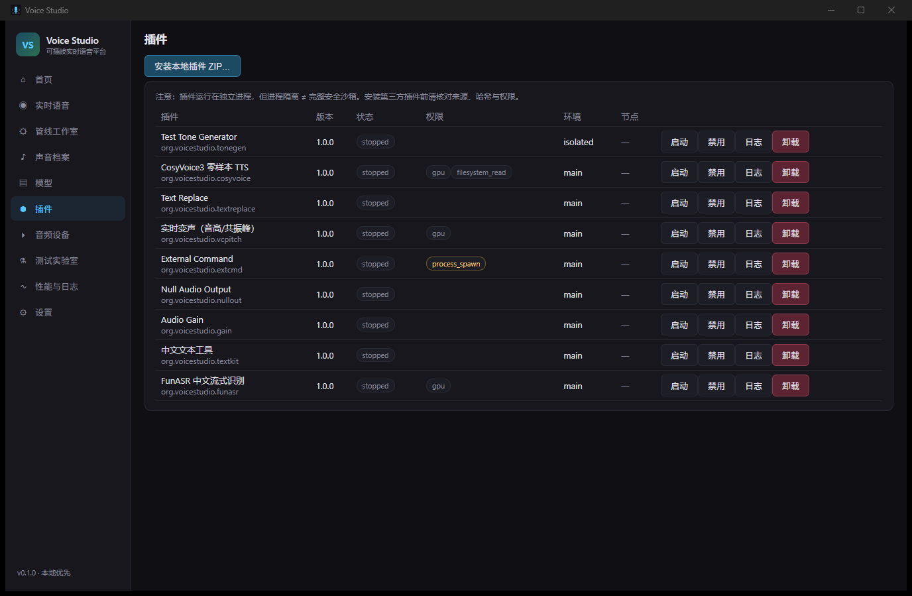

[English](README.md) | [简体中文](README.zh-CN.md)

# Voice Studio

A Windows-first, local-first desktop workbench for designing and running composable real-time voice pipelines.

Voice Studio connects microphone capture, audio processing, speech recognition, text processing, speech synthesis, voice effects, monitoring, and virtual output in a visual node graph. The desktop host and non-AI paths can be built from source; AI models and hardware-specific runtimes are added separately.

> **Project status:** the repository is prepared for local source builds. This is not evidence of a public binary release, hosted download, or enabled remote automation. Binary distribution, model redistribution, third-party notice packaging, and hardware-specific AI stacks remain separate verification and owner-decision gates.

~~~text
Microphone → DSP / VAD → ASR → text tools → zero-shot TTS / voice effects → monitor or virtual output
~~~

## Core capabilities

- **Visual pipeline studio:** compose typed nodes, validate connections before start, load presets, and manage bounded queues and backpressure.
- **Windows audio host:** WASAPI capture and playback through cpal, resampling, WAV input/recording, gain, high-pass filtering, noise gate, limiter, channel conversion, and device-change protection.
- **Local plugin workers:** Python plugins run as independent processes over a versioned gRPC control and streaming data plane.
- **Built-in voice workflows:** streaming FunASR recognition, CosyVoice3 zero-shot TTS, Chinese segmentation and normalization, pitch/formant voice conversion, and non-AI example plugins.
- **Operational controls:** push-to-talk, mute, clear queue, interrupt, device/model/plugin management, voice profiles, test lab, local logs, and crash-safe recovery.
- **Extensible UI:** plugin parameter schemas are rendered by the Vue interface without allowing plugins to inject arbitrary WebView scripts.

## Product tour

### Build the signal path

*The node editor joins built-in audio processors and plugin nodes, with presets, validation, import/export, and a schema-driven property panel.*

### Run and control a pipeline

*The live view keeps start/stop, push-to-talk, mute, queue clearing, interruption, recognized text, level, and runtime state together.*

### Keep reference audio local

*Voice profiles reference user-provided WAV files under local application data. The project does not bundle third-party character voices.*

### Make model provenance visible

*Models are managed as local assets. They are not included in the source tree or host package and must come from owner-approved provider revisions.*

### Inspect plugin boundaries

*The plugin manager exposes versions, declared permissions, runtime environments, state, logs, and lifecycle controls.*

## Architecture

| Layer | Responsibility |
|---|---|
| **Tauri 2 + Rust host** | Window lifecycle, IPC, hotkeys, devices, audio callbacks, pipeline scheduling, plugin lifecycle, persistence, resource checks, and diagnostics across eight workspace crates. |
| **Vue 3 interface** | The WebView UI: pipeline canvas, live controls, profiles, models, plugins, devices, test surfaces, settings, and schema-generated parameter forms. It does not run inference or audio DSP. |
| **Python SDK and workers** | Versioned plugin API, independent worker processes, gRPC control/streaming, and adapters that reuse the repository’s ASR, TTS, text, and voice-processing engines. |
| **Local state** | SQLite plus app-data directories for settings, pipelines, plugins, references, models, logs, caches, and recovery state. |

The standard data path stays on the machine:

~~~text
Vue UI ──Tauri IPC──> Rust host ──127.0.0.1 gRPC──> Python plugin workers
                           │
                           └── WASAPI / files / SQLite / local application data
~~~

Repository map:

~~~text
apps/desktop/          Tauri 2 + Vue desktop application
crates/                eight Rust host crates
proto/                 versioned plugin protocol
sdk/python/            Python Plugin SDK
plugins/ai/            FunASR, CosyVoice, TextKit, and pitch/formant plugins
plugins/examples/      five non-AI example plugins
app/                   reusable Python speech engines
scripts/               setup, run, test, diagnostics, model, and packaging entry points
docs/                  architecture, build, plugin, security, and dependency references
~~~

See [Architecture](docs/ARCHITECTURE.md), [Audio engine](docs/AUDIO_ENGINE.md), and [Protocol](docs/PROTOCOL.md) for the detailed boundaries.

## Quick start from source

### Requirements

Use the repository root on Windows 11 with Windows PowerShell 5.1:

- Node.js 24.x and pnpm 9.15.0
- Python 3.12.x
- Rust/Cargo through rustup
- Visual Studio 2022 Desktop development with C++ workload and a Windows SDK
- Git
- A Windows input/output audio device

The Rust toolchain channel is not yet pinned by a rust-toolchain.toml. A custom Cargo executable can be selected with VOICE_TRANSLATOR_CARGO; the repository does not require a private toolchain directory.

### Set up and launch

~~~powershell
.\scripts\setup.ps1
.\scripts\run.ps1
~~~

setup.ps1 checks the toolchain, creates or updates .venv, installs the locked direct Python dependencies, verifies the pinned CosyVoice source tree, performs a frozen pnpm install, builds the frontend and Rust host with locked dependency resolution, installs the nine built-in plugins into local application data, and runs the Python SDK smoke test.

It does **not** download AI models, choose a torch/torchaudio build, install a virtual audio driver, create an installer, or prove release readiness.

For a development window:

~~~powershell
.\scripts\run.ps1 -Dev
~~~

Offline setup and launch are available only after the pip, pnpm, Cargo, CosyVoice, and model inputs have been prepared:

~~~powershell
.\scripts\setup.ps1 -Offline
.\scripts\run.ps1 -Offline
~~~

Read [Building and first use](docs/BUILDING.md) and [Troubleshooting](docs/TROUBLESHOOTING.md) before preparing AI or offline environments.

## First use, models, connectivity, and hardware

1. Open **Audio Devices** and select a microphone and monitoring output.
2. Use a built-in non-AI path first, or prepare the AI stack described below.
3. Load or compose a preset in **Pipeline Studio**, validate it, and start it from the studio or live view.
4. For virtual microphone routing, install a compatible driver such as VB-CABLE manually and select its input/output pair. Voice Studio does not install drivers or request elevated privileges on its own.

### Model and AI boundary

- Models are ignored local assets and are not bundled with the repository, NSIS host package, or portable host archive.
- requirements.txt pins 34 direct Python dependencies, but it is not a complete transitive wheel-hash lock.
- torch and torchaudio are intentionally outside requirements.txt. The owner must approve the CPU/CUDA target, package index, versions, and wheel hashes.
- The model downloader requires immutable, owner-approved provider revisions. Inspect its current arguments before use:

~~~powershell
.\.venv\Scripts\python.exe scripts\download_models.py --help
~~~

- Model licenses, voice rights, GPU memory, inference speed, and audio quality depend on the chosen artifacts and hardware. No single GPU or latency claim is made here.

### Network behavior

| Action | Expected network behavior |
|---|---|
| Online setup | May contact pip and pnpm registries, Cargo sources, and the pinned CosyVoice Git source. |
| Offline setup | Uses no-index/offline modes and fails if required caches or source trees are missing. |
| Model preparation | Explicit only; downloads from the provider/revision supplied by the owner and records local provenance after required-file checks. |
| Normal audio processing | Microphone audio, reference audio, transcripts, pipelines, and logs remain local in the standard configuration. |
| Third-party plugins | A plugin declaring network access may connect externally. Permissions are visible but not an operating-system sandbox. |

Install only trusted plugins. Process isolation limits crash propagation, but it does not enforce filesystem or network isolation; see [Security architecture](docs/SECURITY.md).

## Development and testing

Use the repository scripts as the common entry points:

~~~powershell
# Contributor baseline: Rust workspace + full desktop package + Python SDK loopback
.\scripts\test.ps1 -SkipAi

# Adds the real AI pipeline gate; requires the approved models/runtime/hardware
.\scripts\test.ps1

# Adds the 30-minute soak after the selected test path
.\scripts\test.ps1 -Soak
~~~

The scripts stop on the first failing step and preserve its exit code. AI/GPU, physical audio devices, virtual routing, GUI behavior, and soak results are independent gates; a non-AI result must not be presented as evidence for them.

For the frontend-only type/build check defined by the current manifest:

~~~powershell
pnpm --filter voice-studio-desktop check
~~~

This README documents the entry points; it does not claim that these gates were executed in this documentation update.

## Plugin SDK

The Python SDK lives in sdk/python/voice_plugin_sdk. A plugin supplies a plugin.toml manifest and a Python factory, declares permissions and runtime requirements, and returns typed node schemas during the versioned handshake.

Generate a starter plugin:

~~~powershell
.\scripts\create_plugin.ps1 my-plugin -Type tts
~~~

Supported templates are dsp, text, tts, asr, vc, and external. Generated plugins default to Apache-2.0 package metadata and refuse to overwrite an existing target.

Continue with [Plugin development](docs/PLUGIN_DEVELOPMENT.md) and the [Manifest reference](docs/PLUGIN_MANIFEST.md).

## Now, next, and known limits

### Available in the source tree now

- The Tauri/Vue desktop host, Rust audio and pipeline layers, Python SDK, four AI plugin adapters, five example plugins, presets, local persistence, diagnostics, and source build scripts are present.
- Source availability and build entry points are distinct from a verified public binary release.
- Public source availability does not, by itself, prove a GitHub Release, public binary download, enabled CI workflow, download count, or support SLA.

### Decisions required before broader distribution

- Approve and pin the Rust toolchain.
- Produce a complete Python transitive hash lock and approve torch/torchaudio targets.
- Approve immutable model revisions and their licenses and redistribution terms.
- Generate release-specific SBOM, license, copyright, and NOTICE materials.
- Validate packaging, Windows GUI, physical audio, virtual routing, AI/GPU, and long-running behavior on the intended release hardware.
- Define a version support policy and any support SLA.

### Known limits and extension points

- Windows 11 is the primary platform; other desktop platforms are not claimed supported.
- Virtual microphone output depends on a separately installed driver.
- Plugin permissions are declarative; a stronger Job Object/AppContainer sandbox is an architectural extension point.
- WASAPI shared mode is the current baseline. Exclusive mode, ASIO, Rust/external/http plugin runtimes, shared-memory transport, and a remote plugin index are possible extension points, not release commitments.
- Model downloads, model licenses, and user-provided voices remain outside the project’s Apache-2.0 grant.

See [Dependency policy](docs/DEPENDENCY_POLICY.md) and [Third-party notices](THIRD_PARTY_NOTICES.md) for the current owner gates.

## Contributing, security, and license

- Contributions: [CONTRIBUTING.md](CONTRIBUTING.md)
- Vulnerability reporting policy: [SECURITY.md](SECURITY.md)
- Security and privacy architecture: [docs/SECURITY.md](docs/SECURITY.md)
- Changelog: [CHANGELOG.md](CHANGELOG.md)
- Third-party notices: [THIRD_PARTY_NOTICES.md](THIRD_PARTY_NOTICES.md)
- Project license: [Apache License 2.0](LICENSE)

The Apache-2.0 license applies to this repository’s own code. Dependencies, external source trees, models, drivers, and user-provided audio remain under their respective terms.
